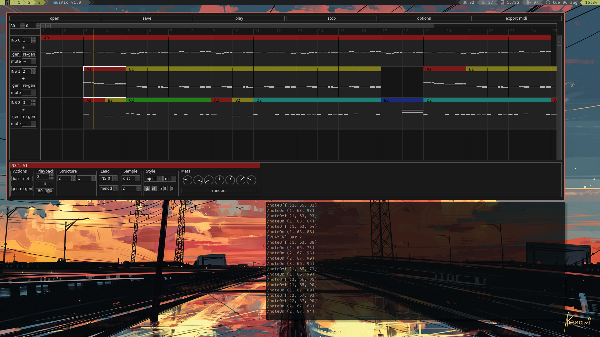

# musAIc

Interface for composing music with an A.I. musician.



Currently in active development.

## Basic Installation

### Requirements

It is recommended to use Python version 3.6.x since I have encountered issues with installing `tensorflow` and `keras` on later versions of Python. The best way of making this easy is to use isolated environments, such as with [pyenv](https://github.com/pyenv/pyenv).

### Linux / Mac

1. `$ git clone` this repository to somewhere in your home directory

2. Make sure you are in a Python 3.6.x environment (e.g. with global `$ python3 -v` is 3.6.x, or with something like [pyenv](https://github.com/pyenv/pyenv))

3. Install the required packages with ```$ pip install -r requirements/base.txt```

4. Launch `musAIc` with ```$ python src/main/python/main.py```

### Windows

1. Install `git` from [here](https://git-scm.com/downloads)

2. Make sure Python 3.6.8 (64-bit) is installed and added to PATH (get the installer [here](https://www.python.org/downloads/release/python-368/))

3. Open Windows PowerShell (right-click the Start button and select from the menu, or search `powershell.exe`) and `cd` to which directory will host `musAIc`

4. `$ git clone https://github.com/Denbergvanthijs/musaic.git` this repository in some folder.

5. `pip install wheel cython`

6. `pip install --upgrade pip`

7. `pip install ./requirements/rtmidi_python-0.2.2-cp36-cp36m-win_amd64.whl`

8. Install the required packages with ```$ pip install -r requirements/base.txt```

9. Launch `musAIc` with ```$ python src/main/python/main.py```

## Detailed Instructions

For complete beginners in Python and Terminal

### Mac

1. Open Terminal from the Finder.

2. Install XCode, Homebrew and Python 3.X. A simple guide that covers these can be found [here](https://installpython3.com/mac/). Follow the steps up until the Virtual Environments stuff (I recommend something easier in the next step)

3. Install [pyenv](https://github.com/pyenv/pyenv):

   ```bash
   brew install pyenv openssl readline sqlite3 xz zlib
   echo -e 'if command -v pyenv 1>/dev/null 2>&1; then\n  eval "$(pyenv init -)"\nfi' >> ~/.bash_profile
   ```

   Restart the Terminal.

4. Create a folder and navigate to where you would like to install musAIc (this is done with the commands `$ mkdir DirectoryName/` to make directories and `$ cd path/to/directory` to move into a directory). This could be in somewhere like `Projects/`, `Music/Tools/`, or whatever you like to do to organise your projects.

5. Download (clone) this repository in this folder with the command, and move into the folder:

   ```bash
   git clone https://github.com/Denbergvanthijs/musaic.git
   cd musaic
   ```

6. Create a virtual environment and install dependencies:

   ```bash
   pyenv install 3.6.8
   pyenv local 3.6.8
   ```

   (Verify that the command `$ pyenv which python` returns some path with `3.6.8` somewhere in it)

7. Finally, launch musAIc with the command `$ python src/main/python/main.py`

8. **Bonus**: to make it easier to start musAIc without using the terminal, first copy the output of the command `$ pwd` in the directory you launched musAIc from. Then, create a new file with your favourite text editor called `musaic.sh` and put in the following with the path you just copied:

   ```bash
   #!/bin/bash
   
   cd PATH_YOU_JUST_COPIED
   python src/main/python/main.py &
   ```

   Save this file to Desktop, then in Terminal run the command:

   ```bash
   sudo chmod +x ~/Desktop/musaic.py
   ```

   (If you are prompted to enter your password, do so and press enter)

   Now, to launch musAIc just double click `musaic.sh`!

## Usage

**Work In Progress**

### Using MIDI out

1. Make sure whichever MIDI device you wish to use (either through a soundcard, USB or a virtual MIDI cable) is initialised and working _before_ starting `musAIc`

2. Once started click `options`, tick the box next to MIDI, then select your MIDI device from the dropdown menu. Optionally you can send the MIDI clock signal too (on by default), however, this is largely untested and may act weird.

Note: there is also a small bug where re-opening the options dialog will reset which MIDI device it will use, so make sure to select the desired one again.

### Changing the AI musicia

`musAIc` is currently bundled with two neural networks: the original developed in 2019 (affectionately named `VERSION 9`), and the WIP pop star `EUROAI`. In the future they (and others!) would be selectable from within the GUI, however for now the only way is to change the `PLAYER` global variable in `src/main/python/network.py` to either 1 for `VERSION_9`, 2 for `EUROAI`, 3 for `SMT22` or 0 for a random number generator (for development/debugging, will not load `tensorflow`).

### Training a Neural Network

Currently, the neural network (NN) from `.\src\main\python\train_transformer.py` is implemented. This NN can be trained with the following command:

```bash
python .\src\main\python\train_transformer_thijs.py
```

Make sure to use the proper version of Tensorflow 2, Keras, Numpy and other libraries. These can be found in the `./requirements/base.txt` file. The trained network is stored in the `.\src\main\python\smt22\model.tflite` file. This file is loaded by MusAIc in the `TransformerNet` class of the `.\src\main\python\network.py` file.

Currently, the NN architecture is as follows:


Training scripts for other configurations of models can also be found, they are named `train_*.py`. These models are not guaranteed to work and require some changes to musaic.

### Generating batches of music

The script to generate a batch of music can be found in `.\src\main\python\batch_generate.py`. Run this script as the following:

```bash
python .\src\main\python\batch_generate.py
```

Make sure you are using the correct Python installation, Tensorflow version and have selected the correct `PLAYER`. You can change the `PLAYER` in the `.\src\main\python\network.py` script. Generated music is stored in the `ROOT_PATH` folder which can be altered in the `batch_generate.py` script. Each combination of `PARAMETER_RANGES` is used to generate `N` songs. For instance, if you have `30` combinations of parameters and set `N` to `10`, a total of `30 * 10 = 300` songs will be generated.

Due to multiprocessing issues, the `Engine()` needs to be re-created after each song. This will prevent memory leakage issues that cause the program to become stuck after several songs.

### Example data output

Example data which the model is trained on can be found in the pickle files at `.\src\main\python\v9\Data\lessfiles`. The contents of these files can be inspected with the `data_exploration.ipynb` notebook. The new data generator is showcased in `data_generator_example.py`.

## Issues

- The MIDI box in the options menu needs to be selected to hear sounds
- MusAIc will stop generating new bars if all five styles (qb, eb, lb, fb, tb) are de-selected
